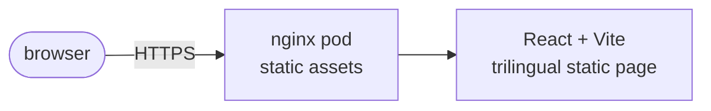

<div align="center">

# Origin Labs

**Build what's next.**  
Brazilian software house · Product engineering · AI systems · Platforms

[](https://github.com/originlabsbr/originlabs-landing/actions)
[](LICENSE)

<br />

</div>

---

## Why Origin Labs?

Origin Labs is a Brazilian software house building useful digital products and durable systems. Small team, senior engineering, direct communication: product engineering, AI systems, platforms and infrastructure, data and automation.

- **Ideas first.** Clarify the problem and smallest useful outcome before technology.
- **Engineering discipline.** Small testable steps, direct communication, sound foundations.
- **Real impact.** Ship, learn from use, improve what creates value.

## Features

|  |  |
|--|--|
| 🌐 **Trilingual** | English, Brazilian Portuguese, and Spanish with persisted selector |
| 🌗 **Themes** | Light and dark with system preference fallback |
| ♿ **Accessible** | Semantic landmarks, skip link, keyboard focus, reduced motion |
| 🐳 **Docker-first** | Unprivileged nginx static image published to GHCR |

## Architecture

One static React page. `src/App.tsx` owns content and translations. `src/styles.css` owns the responsive editorial layout and orbital visual system. Vite emits deployable files to `dist/`. No API, router, or runtime configuration.



See [docs/architecture](docs/architecture/overview.md) for the layout system and [docs/deployment](docs/deployment/setup.md) for the homelab handoff.

## Quick Start

Requirements: Node.js 24 and npm.

```bash
git clone https://github.com/originlabsbr/originlabs-landing && cd originlabs-landing
npm ci
npm run dev
```

Other useful commands:

```bash
npm test            # landing content, locale, and theme tests
npm run typecheck   # TypeScript check
npm run build       # production build to dist/
npm run preview     # preview the production build
```

Production-like stack (unprivileged nginx on `http://localhost:8080`):

```bash
docker build -t originlabs-landing .
docker run --rm -p 8080:8080 originlabs-landing
```

## Stack

| Layer | Technology |
|-------|-----------|
| UI | React 19, TypeScript, Vite |
| Styling | Plain CSS, custom properties, no framework |
| DevOps | Docker, unprivileged nginx, GitHub Actions, GHCR |
| Deployment | [homelab](https://github.com/mateuseap/homelab) GitOps cluster |

## Documentation

| Doc | Description |
|-----|------------|
| [System Overview](docs/architecture/overview.md) | Layout system, orbital visual, i18n and theme model |
| [Development Setup](docs/development/setup.md) | Local dev, translations, theme conventions |
| [Deployment Guide](docs/deployment/setup.md) | GHCR images, homelab manifests, staging and production hosts |
| [Testing](docs/testing.md) | Test layout and how to run |
| [References](docs/references.md) | Curated study links for the stack |

## Contributing

Read [CONTRIBUTING.md](CONTRIBUTING.md) before opening a PR. Branch from `develop`, use Conventional Commits, keep the test suite green, and assign **@mateuseap** for review on PRs into `develop`.

## License

MIT, see [LICENSE](LICENSE).
