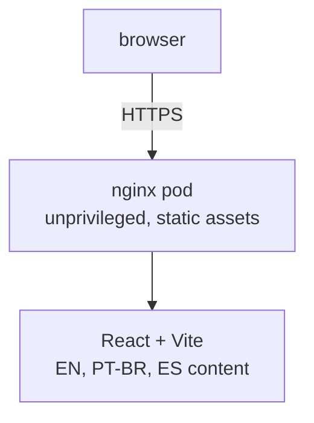

# System Overview

Origin Labs landing is one static trilingual page. React owns content and translations; CSS owns the responsive editorial layout, orbital visual, and light/dark themes; Vite emits deployable files to `dist/`.

## Layout System

A left rail holds the wordmark, navigation, language selector, and theme toggle. The main column flows hero, capabilities, approach, work, contact, and footer. A fixed orbital SVG anchors the hero without images or fonts beyond Inter.

## Internationalization

Every user-facing string ships in English, Brazilian Portuguese, and Spanish from one translation table in `src/App.tsx`. The selector persists to `localStorage` and updates `document.documentElement.lang` and the meta description.

## Themes

Light and dark palettes are CSS custom properties under `data-theme`. The toggle persists to `localStorage`; unset preference follows `prefers-color-scheme` and tracks system changes until the user chooses explicitly.
